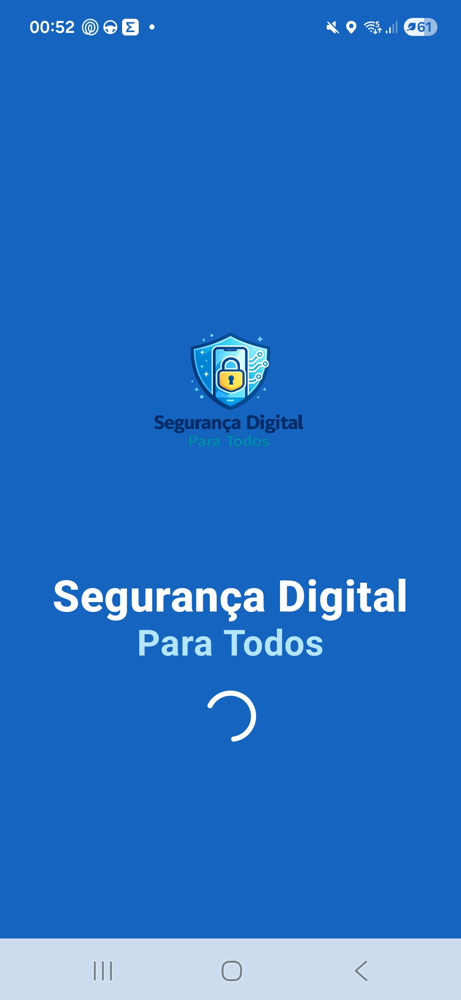
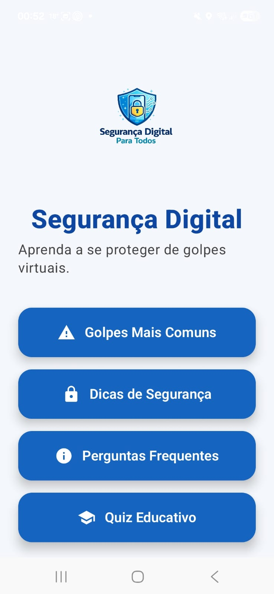
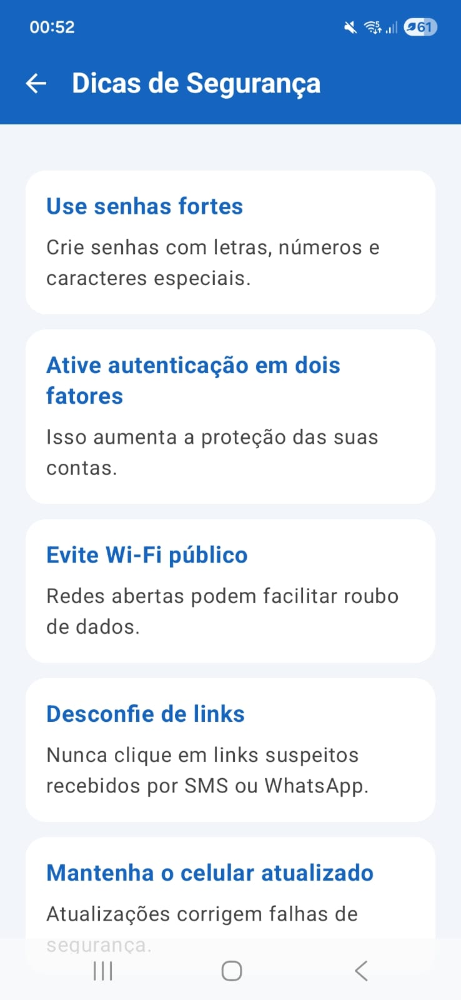
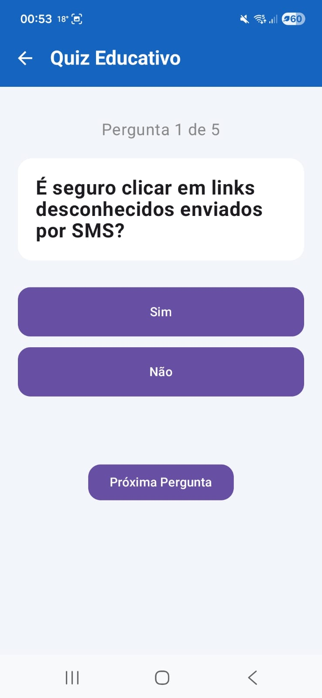

# Segurança Digital Para Todos

Aplicativo educacional desenvolvido em Kotlin e Jetpack Compose com foco em conscientização sobre segurança digital.

---

# Objetivo

O projeto tem como objetivo auxiliar usuários comuns a compreender práticas essenciais de segurança digital, prevenção contra golpes online e proteção de dados pessoais.

---

# Tecnologias Utilizadas

* Kotlin
* Jetpack Compose
* Android Studio
* Material Design

---

# Funcionalidades

* Dicas de segurança digital
* Orientações sobre senhas seguras
* Prevenção contra golpes virtuais
* Interface simples e intuitiva
* Conteúdo educativo acessível

---

# Screenshots

## Tela Inicial



## Menu Principal



## Golpes Mais Comuns


## Dicas de Segurança



## Perguntas Frequentes


## Quiz Educativo



---

# Estrutura do Projeto

```text
SegurancaDigitalParaTodos/
│
├── app/
├── screenshots/
├── gradle/
├── README.md
└── settings.gradle.kts
```

---

# Melhorias Futuras

* Sistema de login
* Gamificação
* Notificações educativas
* Conteúdo offline
* Área administrativa

---

# Autor

Anderson Ribeiro

Projeto acadêmico desenvolvido para fins educacionais.
